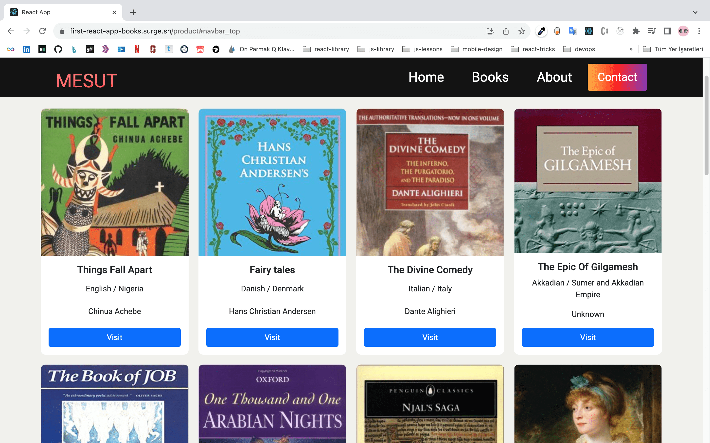

# First React Appp Books

# [Live Preview](https://first-react-app-books.surge.sh/)



> [!NOTE]
>
> - I created this project `Aug 11, 2021` with `js`
> - this is my firs react application
> - I used pure css and bootstrap for style
> - `"react-router-dom": "^5.3.0"` for routing
> - and I learned typescript I convert this project
>   to typescript a `Nov 30, 2023` .

```
  "dependencies": {
    "axios": "^1.6.2",
    "bootstrap": "^5.1.0",
    "react": "^17.0.2",
    "react-dom": "^17.0.2",
    "react-router-dom": "^5.3.0",
    "react-scripts": "^5.0.1",
    "reactstrap": "^8.9.0"
  },
  "devDependencies": {
    "@types/node": "^20.10.1",
    "@types/react": "^18.2.39",
    "@types/react-dom": "^18.2.17",
    "@types/react-router-dom": "^5.3.3",
    "typescript": "^5.3.2"
  },
```
